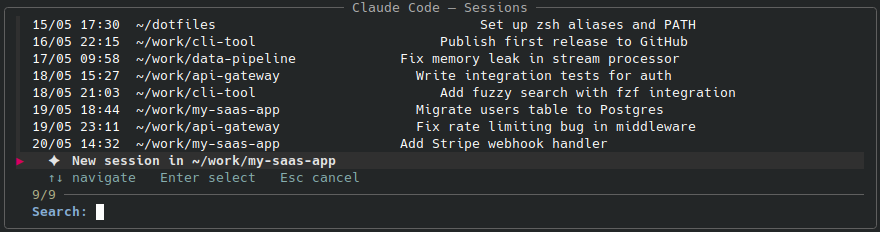

# claude-picker

An interactive session picker for [Claude Code](https://claude.ai/code) — navigate your past sessions with fuzzy search, resume instantly, and land in the right project directory automatically.



## Why

Claude Code's `--resume` flag is powerful, but remembering session UUIDs is not. This script wraps it with a `fzf` menu showing:

- **When** each session was last active
- **Which project** it belongs to
- **What you were working on** — using the AI-generated session title Claude creates automatically

Select a session, press Enter — you're back in context, in the right directory.

## How it differs from similar tools

Most Claude Code session pickers show raw UUIDs or message previews. `claude-picker` uses the `ai-title` field that Claude Code writes to each session's JSONL file — the same title you see in the UI. It's the most accurate description of what a session is about.

It also **`cd`s automatically** to the project directory before resuming, so your terminal lands where the work is.

## Requirements

- [Claude Code](https://claude.ai/code) installed
- [fzf](https://github.com/junegunn/fzf) >= 0.50 (for `--highlight-line` support)
- Python 3 (standard on most systems)
- bash / zsh

## Installation

**1. Download the script:**

```bash
curl -o ~/claude.sh https://raw.githubusercontent.com/nixaicoder/claude-picker/main/claude.sh
chmod +x ~/claude.sh
```

**2. Add the `cc` function to your shell config** (`~/.zshrc` or `~/.bashrc`):

```bash
cc() {
    local _CHOICE_FILE
    _CHOICE_FILE=$(mktemp)

    bash "$HOME/claude.sh" "$_CHOICE_FILE"

    local _SESSION_ID="" _TARGET_DIR=""
    if [[ -s "$_CHOICE_FILE" ]]; then
        IFS=$'\t' read -r _SESSION_ID _TARGET_DIR < "$_CHOICE_FILE"
    fi
    rm -f "$_CHOICE_FILE"

    if [[ -n "$_TARGET_DIR" && -d "$_TARGET_DIR" ]]; then
        cd "$_TARGET_DIR"
        echo "[→] $(pwd)"
    fi

    if [[ -n "$_SESSION_ID" ]]; then
        claude --resume "$_SESSION_ID" "$@"
    else
        claude "$@"
    fi
}
```

**3. Reload your shell:**

```bash
source ~/.zshrc
```

## Usage

Just type `cc` from anywhere:

```
  ┌─ Claude Code — Sesiones ──────────────────────────────────────────┐
  │  ↑↓ navegar   Enter seleccionar   Esc cancelar                    │
  │> 20/05 12:34  ~/work/my-project   Add WebSocket support           │
  │  19/05 22:10  ~/work/api          Fix authentication bug          │
  │  19/05 14:05  ~                   Review pull request             │
  │  ✦  Nueva sesión en /current/dir                                  │
  └───────────────────────────────────────────────────────────────────┘
    Buscar: _
```

- **↑ ↓** or **j k** — navigate
- **Type** — fuzzy filter by date, project, or title
- **Enter** — resume selected session (or start new)
- **Esc** — cancel

## How it works

Claude Code stores session data as JSONL files in `~/.claude/projects/<encoded-path>/`. Each session file contains an `ai-title` entry — a short description generated by Claude at the start of the conversation. `claude-picker` reads these files, sorts by modification time, and feeds them to `fzf`. The selected session ID is passed to `claude --resume`.

The `cc()` shell function (not the script itself) handles the `cd`, since a subprocess cannot change the parent shell's directory.

## Notes on fzf version

Debian/Ubuntu package repos may ship an older fzf. If `--highlight-line` causes errors, install a recent binary from the [fzf releases page](https://github.com/junegunn/fzf/releases).

## License

MIT
